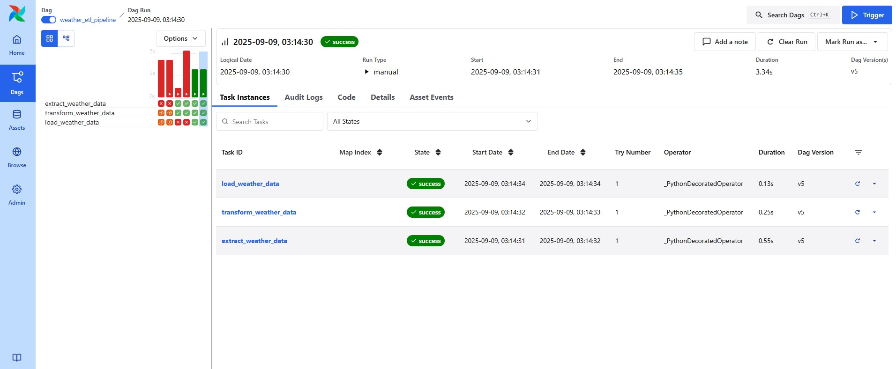

# Weather ETL Pipeline with Apache Airflow (using Astro CLI)

This project implements a simple ETL pipeline using Apache Airflow to extract current weather data from the Open-Meteo API, transform it, and load it into a PostgreSQL database.

---

## Project Overview

- **Extract**: Get current weather data for London (latitude 51.5074, longitude -0.1278) via Open-Meteo API using Airflow's HTTP Hook.
- **Transform**: Parse and format the weather data.
- **Load**: Insert the transformed data into a PostgreSQL table called `weather_data`.
- **Technology stack**: Apache Airflow, PostgreSQL, Astro CLI (for local Airflow environment).

---

## Prerequisites

- [Docker](https://docs.docker.com/get-docker/) installed and running
- [Astro CLI](https://www.astronomer.io/docs/astro/cli-installation) installed
- Internet connection (to fetch data from Open-Meteo API)
- PostgreSQL connection configured inside Airflow (default setup with Astro includes one)

---

## Getting Started

### 1. Clone the repository

```bash
git clone https://github.com/NikaL25/weather-etl-airflow.git
cd weather-etl-airflow


2. Configure Connections in Airflow UI (optional)

The DAG uses Airflow Connections for:

open_meteo_api: HTTP connection for the Open-Meteo API

postgres_default: PostgreSQL connection

If you use default Astro setup, postgres_default should already be configured.
You may need to add the open_meteo_api connection manually:

Go to Airflow UI -> Admin -> Connections

Add a new connection with:

Conn Id: open_meteo_api

Conn Type: HTTP

Host: https://api.open-meteo.com

3. Start Airflow locally with Astro
astro dev start


This will start Airflow UI at http://localhost:8080
.

Login with default credentials:

Username: admin

Password: admin

4. Run the DAG

In the Airflow UI, find the DAG named weather_etl_pipeline.

Trigger the DAG manually by clicking the Trigger DAG button.

Monitor task logs to see extraction, transformation, and loading steps.

Check PostgreSQL database to confirm data was loaded successfully.

Project Structure

dags/weather_etl.py: The main DAG code containing tasks for extract, transform, load.

Dockerfile, astro.yaml: Files for Astro CLI and environment setup.

README.md: This file.

Notes

The DAG is scheduled to run daily (@daily).

Uses Airflow’s taskflow API (@task decorator) for clarity and modularity.

PostgreSQL table weather_data is created automatically if it does not exist.

Make sure your PostgreSQL container or instance is running and accessible if you customize connections.

Troubleshooting

If you get connection or authentication errors for PostgreSQL, verify your Airflow connection postgres_default credentials.

If API calls fail, check the open_meteo_api HTTP connection Host and internet access.

Logs for each task can be found in the Airflow UI under the DAG run details.


### Screenshots



### Data in PostgreSQL


```
